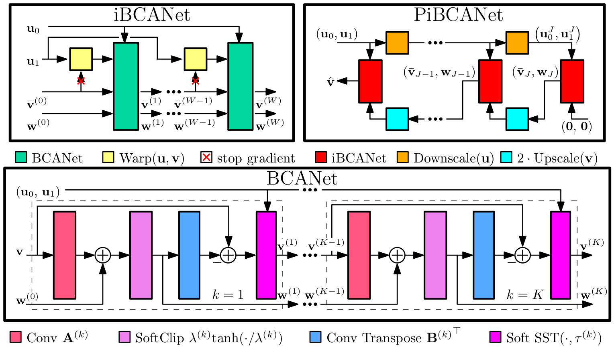

# Unrolled Primal Dual Spliting for Optical Flow Estimation

PiBCANet is deep neural network architecture for estimating optical flow given a grayscale input image pair.
It is derived from an unrolled TVL1 algorithm embedded in a pyramid iterative coarse-to-fine warping strategy.
This is a work in progress!

## Quickstart
Clone this repository and instantiate the environment in the Julia REPL via
```julia
] instantiate
```

Take a look at the `scripts/fit.jl` file for a simple interface with the codebase.
Training can take place at the REPL by editing the parameters of the `scripts/args.yml`,
or via the command line by:
```julia
$ julia --project=. scripts/fit.jl path/to/args.yml
```

## Files
`src/` contains all the source files of the repository.
- `data.jl`: functions and structs for loading MPI-Sintel dataset and Flying Chairs dataset
- `networks.jl`: definition of neural networks
- `solvers.jl`: implementation of classical TVL1 solvers for grayscale and RGB input image pairs
- `train.jl`: definition of training loop
- `UnrolledFlowNetworks.jl`: package file -- exports important functions
- `utils.jl`: preprocessing, convolution, warping utilities

`scripts/` contains useful scripts that use the packge
- `analyze.jl`: some code for plotting training curves and network filters. Edit as needed.
- `args.yml`: the default arguments file when running `fit.jl` from the REPL and a template for training 
your own networks.
- `fit.jl`: basic script for training a network given its `args.yml` file.
- `visual.jl`: visualization functions

`tests/` contains some nasty scripts for verifying funcationality.
- `solver_passthrough.jl`: evaluate a classical solver over a dataset.

## TODO
- cleanup:
	- separate modules
- write dataloader for middleburry
- unroll TVL1\_VCA, TVL1\_FCA, image-driven smoothness prior (4)
	- sigmoid weighted smoothness
- verify @ein is not falling back to loop implementation on GPU
	- use tullio.jl?
